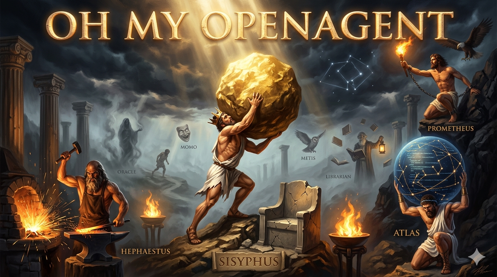

# OpenCode + OMO

[](https://opensource.org/licenses/MIT)
[](https://github.com/hrodres/opencode-omo-sota/commits/main)

<p align="center">
  
</p>

> **Routing SOTA para OpenCode + OMO**
>
> Fuente de verdad operativa para configuraciones de [Oh My OpenAgent](https://github.com/code-yeongyu/oh-my-openagent) con planes de modelo específicos.

## ¿Qué es esto?

Este repositorio contiene configuraciones funcionales y documentadas para usar [OpenCode](https://opencode.ai/) + Oh My OpenAgent (OMO) con diferentes planes de suscripción, aplicando la filosofía de **tiered model routing** descrita en el artículo de [Jatin K Malik](https://medium.com/@jatinkrmalik/opencode-go-oh-my-openagent-the-complete-guide-to-sota-model-routing-without-hitting-limits-49fdc8cb3417).

Cada carpeta representa un **plan de suscripción** (`opencode-go/`, `zen/`, etc.) y es **self-contained**: contiene la configuración JSON operativa, el prompt para recrearla/actualizarla, y su propia documentación.

> ### ✅ Caso de uso oficialmente documentado
>
> Esta configuración **no es un hack**. Los autores de Oh My OpenAgent documentan explícitamente el escenario *"User has OpenCode Go only"* en su [guía de instalación](https://ohmyopenagent.com/docs):
>
> ```bash
> bunx oh-my-opencode install --no-tui --claude=no --openai=no --gemini=no --copilot=no --opencode-go=yes
> ```
>
> Nosotros implementamos este mismo caso de uso manualmente (editando el JSON directamente) para máximo control y transparencia.

## Estructura

```
opencode-omo-sota/
├── README.md              # Este archivo
├── setup.sh               # Script de instalación automatizada
├── images/                # Infografías e ilustraciones
│   ├── panteon-agentes.png   # Ilustración épica de los agentes
│   └── mapa-agentes.png      # Infografía técnica de agentes y categorías
├── opencode-go/           # Plan OpenCode Go ($10/mes)
│   ├── oh-my-openagent.json  # Configuración operativa
│   ├── PROMPT.md             # Prompt para recrear/actualizar
│   └── README.md             # Guía específica del plan
├── docs/
│   ├── verification.md     # Checklist post-configuración
│   ├── session-example.md  # Caso de uso real
│   ├── architecture.md     # Stack completo
│   └── reference/          # Materiales de referencia
└── CHANGELOG.md
```

## Instalación rápida

```bash
# Clonar repo
git clone https://github.com/hrodres/opencode-omo-sota.git
cd opencode-omo-sota

# Instalar o auditar configuración (backup, validación JSON, verificación de auth y modelos)
./setup.sh opencode-go

# O instalar manualmente siguiendo la guía de opencode-go/README.md
```

### Go-Only vs. Setup estándar de OMO

OMO por defecto asume que tienes **múltiples suscripciones** (Anthropic, OpenAI, GitHub Copilot, OpenCode/Zen) y orquesta entre ellas para usar el mejor modelo para cada tarea.

Esta configuración toma el enfoque **opuesto y conservador**:

| | Setup estándar OMO | Configuración Go-Only (esta repo) |
|---|---|---|
| **Filosofía** | Usa todos los providers disponibles | Usa **exclusivamente** OpenCode Go |
| **Modelos** | Mixtos según agente y disponibilidad | Todos forzados a `opencode-go/*` |
| **Fallbacks** | Chains multi-provider con auto-fallback | Solo `opencode-go/...` → error limpio |
| **Coste** | Variable, depende de qué modelo caiga | Predecible, dentro de límites de Go |
| **Zen** | Disponible como provider más | Desconectado explícitamente |

**¿Cuándo usar esta configuración?**
- Quieres **costes predecibles** sin sorpresas de API
- No tienes (o no quieres usar) suscripciones de Anthropic, OpenAI, etc.
- Prefieres **transparencia total** sobre qué modelo se ejecuta en cada tarea

### ⚠️ OpenCode + OMO no es un chatbot general

OpenCode es una herramienta de **software development**. OMO es un **equipo de ingenieros especializados**.

- **Para coding:** Excelente
- **Para charla/consultas generales:** Considera ChatGPT/Claude (gratis)

Una sesión larga de consultas en OpenCode puede costar $1-2 USD. La misma conversación fuera de OpenCode es gratuita.

## ⚠️ Importante: `setup.sh` no instala software

**`setup.sh` solo copia y valida la configuración JSON.** No instala OpenCode, Oh My OpenAgent ni ninguna dependencia. Asume que ya tienes:

- [OpenCode](https://opencode.ai/) instalado (`opencode --version`)
- [Oh My OpenAgent](https://github.com/code-yeongyu/oh-my-openagent) instalado (`bunx oh-my-openagent install`)
- Suscripción activa (`opencode auth login`)

Si necesitas instalar el software desde cero, sigue la guía completa en [`opencode-go/README.md`](opencode-go/README.md).

Para más detalles, ver [`opencode-go/README.md`](opencode-go/README.md).

## Filosofía: Tiered Model Routing

No uses un solo modelo para todo. Cada agente tiene un trabajo diferente y debe usar el modelo adecuado según complejidad y coste.

Los modelos se organizan en 3 tiers dentro del plan Go. La asignación exacta (qué modelo usa cada agente) está en [`opencode-go/oh-my-openagent.json`](opencode-go/oh-my-openagent.json). Este JSON es la única fuente de verdad para modelos y fallbacks.

| Tier | Característica | Uso típico |
|---|---|---|
| **Tier 1** | Volumen, ultra-rápidos, nunca rate-limited | Búsquedas, tareas rápidas, exploración de código |
| **Tier 2** | Balance calidad/coste | Implementación de features, debugging, review |
| **Tier 3** | Máxima calidad, límites ajustados | Orchestración, arquitectura, reasoning complejo |

**Regla de oro:** Si una tarea requiere muchos requests, empieza por Tier 1 y escala solo si se atasca.

## Capacidades de los modelos

Consulta [`docs/capabilities.md`](docs/capabilities.md) para benchmarks y evaluación de los modelos configurados.

Los modelos exactos y sus fortalezas están definidos en [`opencode-go/oh-my-openagent.json`](opencode-go/oh-my-openagent.json). En general, el ecosistema Go ofrece:
- **Tier 1:** Indistinguibles de frontier para tareas simples, velocidad extrema
- **Tier 2:** Excelentes para implementación y debugging, competitivos con frontier
- **Tier 3:** Óptimos para orquestación y reasoning complejo, a 5-10 puntos de frontier en benchmarks más exigentes

## Planes disponibles

### [opencode-go/](opencode-go/)

Plan de suscripción de $10/mes con acceso a modelos open-source de última generación. Ver [`opencode-go/oh-my-openagent.json`](opencode-go/oh-my-openagent.json) para los modelos configurados actualmente.

- **Ventaja:** Coste fijo, límites generosos, 80-90% de calidad frontier
- **Compromiso:** Necesita 1-2 iteraciones extra en arquitectura compleja
- **Ideal para:** Desarrollo diario, agentic workflows, CI/CD

## Cómo usar este repo

### Para configurar por primera vez

1. Clona este repo o copia la carpeta del plan que necesites
2. Sigue la guía específica en `opencode-go/README.md`
3. Copia el `oh-my-openagent.json` a `~/.config/opencode/`
4. Reinicia el servidor OpenCode

### Para actualizar modelos

Cuando OpenCode añada nuevos modelos o retire otros:

1. Abre `PROMPT.md` de la carpeta correspondiente
2. Sigue las instrucciones de "Actualización"
3. Valida que el JSON sigue siendo válido

## Seguridad y buenas prácticas

- **Nunca subas `auth.json`** a este repo (está en `.gitignore`)
- **Haz backups locales** antes de cambios (`cp oh-my-openagent.json oh-my-openagent.json.backup-$(date)`)
- **Mantén Zen desconectado por defecto** si no lo usas activamente

## Recursos

- [Oh My OpenAgent - GitHub](https://github.com/code-yeongyu/oh-my-openagent)
- [OpenCode Go Docs](https://opencode.ai/docs/go/)
- [Artículo base - Jatin K Malik](https://medium.com/@jatinkrmalik/opencode-go-oh-my-openagent-the-complete-guide-to-sota-model-routing-without-hitting-limits-49fdc8cb3417)

## Licencia

MIT - Usa, modifica y comparte libremente.
